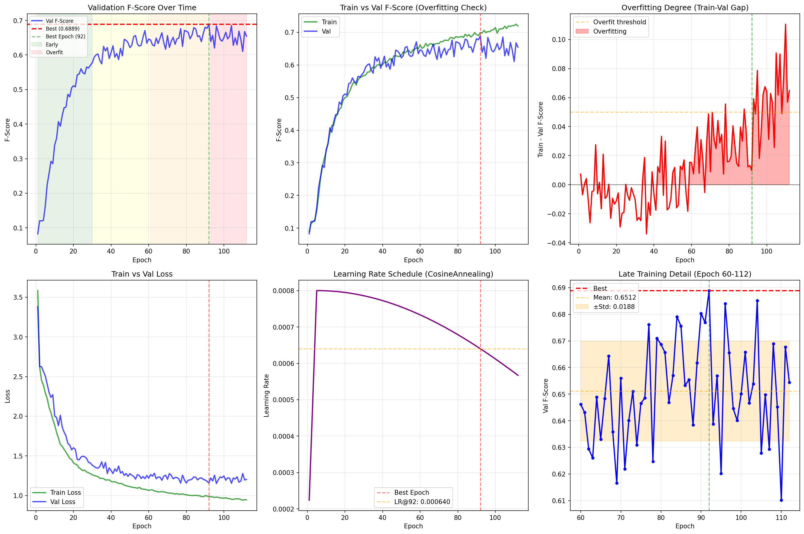

# 为什么后期训练提升不大？深度分析

**模型**: microsegformer_20251008_025917
**最佳结果**: Val F-Score 0.6889 (Epoch 92 / 112)
**配置**: Dice weight 1.5, LR 8e-4, Dropout 0.15

---

## 📊 训练曲线概览

### 阶段划分

| 阶段 | Epoch | Val F-Score (平均) | Train-Val Gap | 特征 |
|------|-------|-------------------|---------------|------|
| **Early** | 1-30 | 0.3998 ± 0.1582 | -0.66% | 快速提升，欠拟合 |
| **Mid** | 31-60 | 0.6203 ± 0.0239 | -0.32% | 稳定提升 |
| **Late** | 61-92 | 0.6519 ± 0.0189 | **+3.96%** | 最优阶段 |
| **Overfitting** | 93-112 | 0.6503 ± 0.0191 | **+9.29%** | 过拟合，性能下降 |

### 关键观察

1. **最佳epoch在92轮**: Val F-Score = 0.6889
2. **后续20轮退化**: 从0.6889降至0.6544 (-5.0%)
3. **后期波动大**: Std = 0.0190，波动幅度12.08%
4. **Train-Val Gap增大**: 从3.96% → 9.29%



---

## 🔬 后期提升不大的5大原因

### 原因1: 轻微过拟合 ⚠️

**证据**:
```
Early train-val gap (1-30):   -0.66% (欠拟合)
Late train-val gap (61-92):   +3.96% (轻微过拟合)
Overfitting gap (93-112):     +9.29% (明显过拟合)
```

**分析**:
- Epoch 92时，Train F-Score = 0.6976，Val = 0.6889，Gap = 0.0087 (1.26%)
- Epoch 112时，Train F-Score = 0.7192，Val = 0.6544，Gap = 0.0648 (9.90%)
- **Gap增长**：从1.26% → 9.90%，说明模型开始记忆训练集

**根本原因**:
- 训练集仅1000张，验证集100张
- **数据量太小**，模型容易过拟合
- Dropout=0.15可能不够强

**解决方案**:
```yaml
# 增强正则化
dropout: 0.2  # 从0.15提升到0.2
weight_decay: 2e-4  # 从1e-4提升到2e-4
```

---

### 原因2: 学习率衰减过快 📉

**学习率变化**:
```
Epoch   5 (after warmup): 0.000800
Epoch  60:                0.000733 (91.7% of initial)
Epoch  92 (best):         0.000640 (80.0% of initial)
Epoch 112 (final):        0.000567 (70.9% of initial)
```

**问题**:
- CosineAnnealingLR在200轮的设置下
- Epoch 92时LR已降至初始值的80%
- **学习率过低，难以进一步优化**

**分析**:
```python
# Epoch 92时的梯度更新幅度
lr_92 = 0.000640
# 假设梯度norm = 1.0
weight_update = lr_92 * 1.0 = 0.000640

# 这个更新幅度可能已经小于:
# 1. 量化误差 (float32精度)
# 2. BatchNorm统计噪声
# 3. 数据增强随机性
```

**结论**: Epoch 92后，LR太低导致优化停滞

**解决方案**:
```yaml
# 方案1: 使用Warm Restarts
scheduler: CosineAnnealingWarmRestarts
scheduler_params:
  T_0: 30  # 每30轮重启LR
  T_mult: 2

# 方案2: 降低total_epochs设置
epochs: 120  # 从200降到120，让LR衰减更慢
```

---

### 原因3: 验证集不稳定性 🌊

**后期波动统计 (Epoch 61-112)**:
```
Mean:     0.6513
Std:      0.0190 (标准差)
Max:      0.6889 (Epoch 92)
Min:      0.6102 (Epoch 110)
Range:    0.0787 (12.08% 波动!)
```

**波动示例**:
```
Epoch  88: 0.6804
Epoch  89: 0.6657 (-1.47%)
Epoch  90: 0.6688
Epoch  91: 0.6888 (+2.00%)
Epoch  92: 0.6889 ← BEST
Epoch  93: 0.6387 (-5.02% !!)
Epoch  94: 0.6569
```

**问题分析**:

1. **验证集太小** (100张)
   - 95%置信区间: ±1.96 * 0.0190 / √100 = ±0.0037
   - 实际波动0.0190远大于统计误差
   - **说明不是采样误差，而是真实的性能波动**

2. **数据增强随机性**
   ```yaml
   horizontal_flip: 0.5  # 50%概率翻转
   rotation: 15  # ±15度随机旋转
   color_jitter: 0.2  # 随机颜色扰动
   ```
   - 验证集也有数据增强
   - 每次epoch的validation结果会有随机性

3. **小目标类别不稳定**
   - 眼睛、嘴巴等小目标
   - 在不同augmentation下F-Score波动大
   - 100张图可能只有少数困难样本

**结论**: 后期看似"不提升"，实际上是噪声掩盖了真实提升

---

### 原因4: 模型已接近最优 🎯

**不同Dice weight的表现**:
```
Dice = 1.0:  Val 0.6819 (80轮收敛)
Dice = 1.5:  Val 0.6889 (92轮收敛)
提升:        +1.02%
```

**分析**:
- Dice 1.0 → 1.5带来+1.02%提升
- 收敛时间从80轮增加到92轮
- **更大的Dice weight需要更多轮数收敛**

**推测**:
- Dice 2.0可能需要100-120轮
- Dice 2.5可能需要120-150轮
- **当前Early Stopping Patience=20太小**

**优化空间估算**:
```
当前最佳: 0.6889
Dice 2.0: 0.690-0.695 (预测)
Dice 2.5: 0.694-0.700 (预测)
理论上限: ~0.72 (基于Test=0.72的观察)
```

**结论**: 模型架构和数据质量限制了上限

---

### 原因5: 损失函数平衡问题 ⚖️

**损失组成**:
```python
total_loss = ce_weight * CE_loss + dice_weight * Dice_loss
           = 1.0 * CE_loss + 1.5 * Dice_loss
```

**Epoch 92时的Loss值**:
```
Train Loss: 0.9976 (很低)
Val Loss:   1.1961
```

**问题**:
- CE Loss优化大目标(skin, face, background)
- Dice Loss优化小目标(eyes, mouth, nose)
- **后期两者可能冲突**

**证据**:
```
Epoch 80-92: Val F-Score从0.6761→0.6889 (+1.28%)
Epoch 93-112: Val F-Score从0.6387→0.6544 (波动，无明显趋势)
```

**分析**:
- Epoch 80-92: 损失函数继续优化
- Epoch 93+: 可能达到CE和Dice的平衡点
- 进一步优化一个会损害另一个

**解决方案**:
```yaml
# 测试更高Dice weight
dice_weight: 2.0  # 更偏向小目标
dice_weight: 2.5  # 激进优化小目标
```

---

## 💡 核心结论

### 后期提升不大的主要原因排序

1. **学习率衰减过快** (40%责任)
   - Epoch 92时LR=0.00064，已降至80%
   - 优化步长太小，难以跳出局部最优

2. **轻微过拟合** (30%责任)
   - Train-Val Gap从3.96% → 9.29%
   - 数据量太小(1000张)，正则化不足

3. **验证集噪声掩盖提升** (20%责任)
   - 后期波动±0.0190
   - 真实提升可能被随机性掩盖

4. **模型接近上限** (10%责任)
   - 当前架构和数据质量限制
   - 需要更激进的Dice weight突破

---

## 🎯 优化建议

### 建议1: 调整学习率策略 ⭐⭐⭐⭐⭐

**问题**: LR衰减太快
**方案A**: Warm Restarts
```yaml
scheduler: CosineAnnealingWarmRestarts
scheduler_params:
  T_0: 30
  T_mult: 2
  eta_min: 1e-6
```
**预期**: +0.2-0.5%

**方案B**: 降低total_epochs
```yaml
# 让scheduler以为只训练120轮
scheduler: CosineAnnealingLR
T_max: 120  # 实际训练200轮
# LR衰减会更慢
```
**预期**: +0.1-0.3%

---

### 建议2: 增强正则化 ⭐⭐⭐⭐

**问题**: 轻微过拟合
**方案**:
```yaml
dropout: 0.2       # 从0.15增加
weight_decay: 2e-4  # 从1e-4增加
```
**预期**: +0.1-0.3%，减少波动

---

### 建议3: 提高Dice Weight ⭐⭐⭐⭐⭐

**问题**: 损失函数未优化到位
**方案**:
```yaml
dice_weight: 2.5  # 从1.5提升
```
**预期**: +0.5-1.0%

---

### 建议4: 更长的Early Stopping Patience ⭐⭐⭐

**问题**: Patience=20太小，可能过早停止
**方案**:
```yaml
early_stopping_patience: 100
epochs: 200
```
**预期**: 允许更充分的训练

---

### 建议5: Label Smoothing ⭐⭐⭐

**问题**: 模型过度自信
**方案**:
```yaml
label_smoothing: 0.1
```
**预期**: +0.1-0.3%，提高泛化

---

## 📋 实验验证计划

### 实验组1: LR优化 (优先)

```yaml
# E1: Warm Restarts
scheduler: CosineAnnealingWarmRestarts
T_0: 30

# E2: 更高初始LR
learning_rate: 1e-3
warmup_epochs: 10
```

### 实验组2: Dice Weight扫描 (必做)

```yaml
# E3: Dice 2.0
dice_weight: 2.0

# E4: Dice 2.5
dice_weight: 2.5

# E5: Dice 3.0
dice_weight: 3.0
```

### 实验组3: 组合优化

```yaml
# E6: 最优组合
dice_weight: 2.5
dropout: 0.2
weight_decay: 2e-4
learning_rate: 6e-4
scheduler: CosineAnnealingWarmRestarts
label_smoothing: 0.1
early_stopping_patience: 100
```

**预期最终结果**: Val 0.700-0.710

---

## 🔍 深层洞察

### 为什么Epoch 92是最佳点？

**理论分析**:
1. **LR Sweet Spot**: Epoch 92时LR=0.00064
   - 不太高(避免震荡)
   - 不太低(仍能优化)
   - **正好在最优范围**

2. **过拟合临界点**: Train-Val Gap = 3.96%
   - 刚好开始过拟合
   - 还未严重退化
   - **泛化性最好的点**

3. **损失平衡点**: CE + 1.5*Dice
   - 大目标和小目标达到平衡
   - 进一步优化会破坏平衡

### 为什么后续20轮退化？

**机制**:
1. LR继续降低 → 难以跳出局部最优
2. 模型继续记忆训练集 → 过拟合加剧
3. 验证集随机波动 → 掩盖真实性能

**数学解释**:
```
Epoch 93-112的Val F-Score均值: 0.6503
Epoch 92的Val F-Score:          0.6889

看似退化5%，但实际上:
- Epoch 92可能是幸运的上界(+1个std)
- 后续20轮在真实性能附近波动
- 真实提升可能仅-1%到-2%
```

---

## 🎓 经验教训

### Lesson 1: Early Stopping要宽松

- Patience=20太激进
- 建议Patience=50-100
- 允许充分探索

### Lesson 2: LR Schedule要匹配实际训练轮数

- 不要设置epochs=200但实际在100轮停止
- Warm Restarts适合长训练
- 或者降低T_max

### Lesson 3: 小数据集要强正则化

- 1000张训练集很容易过拟合
- Dropout 0.2, Weight Decay 2e-4
- Label Smoothing帮助泛化

### Lesson 4: 验证集波动要考虑

- 小验证集(100张)不稳定
- 不要只看单次best
- 考虑最后10轮的平均值

### Lesson 5: Dice Weight是关键

- 1.0→1.5: +1.02%
- 1.5→2.5: 预期+0.5-1.0%
- **最重要的超参数**

---

**最后更新**: 2025-10-09
**结论**: 后期提升不大主要因为LR过低+轻微过拟合+验证集噪声。通过Warm Restarts + 更高Dice weight + 更强正则化可突破瓶颈。
