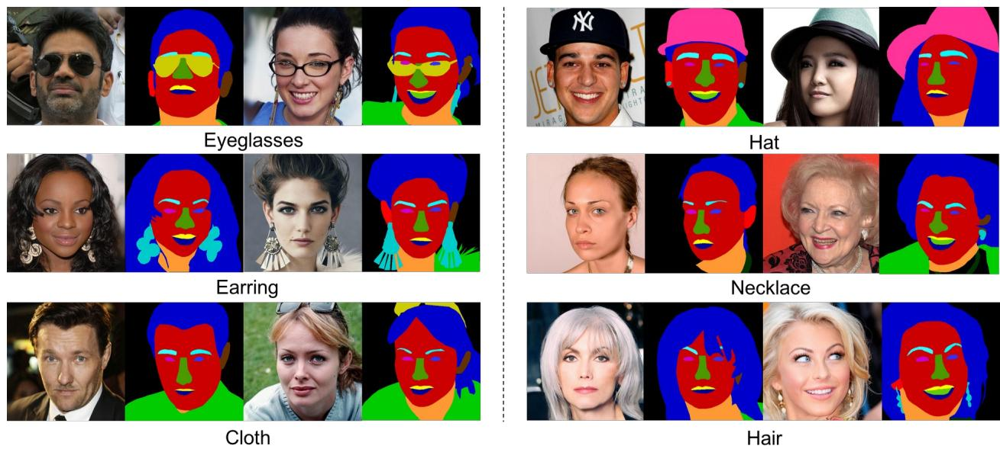

# CE7454 Project 1 CelebAMask Face Parsing

Project 1 Specification

# Important Dates

Issued: 10 September 2025  Due: 14 October 2025 11:59PM

# Group Policy

This is an individual project

# Late Submission Policy

Late submissions will be penalized (each day at  $5\%$  up to 3 days)

# Challenge Description

Face parsing assigns pixel- wise labels for each semantic components, e.g., eyes, nose, mouth. The goal of this mini challenge is to design and train a face parsing network. We will use the data from the CelebAMask- HQ Dataset [1] (See Figure 1). For this challenge, we prepared a mini- dataset, which consists of 1000 training and 100 validation pairs of images, where both images and annotations have a resolution of  $512 \times 512$ .

The performance of the network will be evaluated based on the F- Score between the predicted masks and the ground truth of the test set (the ground truth of the test set will not be released).

  
Figure 1. Sample images in CelebAMask-HQ

# Assessment Criteria

We will evaluate and rank the performance of your network model on our given 100 test images based on the F- Score.

We host the Codabench benchmark for your submission:

NTU CE7454 CelebAMask Face Parsing Project - Codabench

In total, the grade of this project is  $30\%$  of the final course grade. In specific, it consists of four parts:

- Prediction Accuracy  $(30\%)$ - Optimization and regularization  $(20\%)$ - Experimental analysis  $(30\%)$ - Clarity of the report  $(20\%)$

In terms of Prediction Accuracy, we use Codabench above for benchmarking. The higher the rank of your solution, the higher the score you will receive. In general, scores will be awarded based on the Table below.

<table><tr><td>Percentile in ranking</td><td>≤ 5%</td><td>≤ 15%</td><td>≤ 30%</td><td>≤ 50%</td><td>≤ 75%</td><td>≤ 100%</td><td>*</td></tr><tr><td>Scores</td><td>30</td><td>27</td><td>24</td><td>21</td><td>18</td><td>15</td><td>0</td></tr></table>

Notes:

- The benchmark only affects your score for Prediction Accuracy, which is  $30\%$  of the total score for this project.- We will award bonus marks (up to 2 marks) if the solution is interesting or novel.- Marks will be deducted if the submitted files are not complete, e.g., important parts of your core codes are missing, or you do not submit a short report.

# CodaBench Submission Guideline

- Download training dataset- Train your network using our provided training set.- Tune the hyper-parameters using our provided validation set. The script for evaluation is also provided.- To maintain fairness, your model should contain fewer than 1,821,085 trainable parameters. You can use sum(p.numel() for p in model.parameters()) to compute the number of parameters in your network. Please note it in your report.- Submit output images of the test set for evaluations on Codabench. The test set will be available one week before the deadline (this is a common practice of major computer vision challenges).- No external data and pretrained models are allowed in this mini challenge. You are only allowed to train your models from scratch using the 100 image pairs in our given training dataset.- You should not use an ensemble of models.- Knowledge distillation is likewise prohibited for Project 1

# NTULearn Submission Guideline

Each student can only turn in one submission. Resubmission is allowed. But only the latest one will be counted.

Submit the following files (all in a single zip file named with your matric number, e.g., A12345678B.zip) to NTULearn before the deadline (14 October 2025 11:59 PM):

- A short report in pdf format of not more than five A4 pages (Arial 10 font) to describe the model that you use, the loss functions and any processing or operations that you have used to obtain your results. Report the F-measure of your model on the validation dataset, and also the number of parameters of your model.- The results (i.e., the predicted masks) from your model on the 100 test images. Put them in a subfolder and use the same file name as the input image. (e.g. If your

input image is named as 0001. png, your result should also be named as 0001. png)- All necessary codes you used in this project.- The model checkpoint (weights) of your submitted model.- A Readme.txt containing the following info:  - Description of the files you have submitted.  - References to the third- party libraries you are using in your solution (leave blank if you are not using any of them).  - Any details you want the person who tests your solution to know when he/she tests your solution, e.g., which script to run, so that we can check your results.

# Tips

- You can use <CelebA>(https://github.com/switchablenorms/CelebAMask-HQ) or all the other online resources for this project. Please specify in your report the codebase you used.- The following techniques may help you to boost the performance:  - data augmentation  - deeper model (but be careful of the parameter constraint)

# Computational Resource

You can use Amazon's EC2 or Google CoLab for computation. As a student, you can sign up to receive free  $\) 100\(credit through the AWS Educate program. We encourage students to use g2.2xlarge instances running Ubuntu for maximal ease of installing. Note that$ \ $100$  of Amazon credit allows you to run a g2.2xlarge GPU instance for approximately 6 days without interruption (you should keep it on only while using it).

# References

[1] Cheng- Han Lee, Ziwei Liu, Lingyun Wu, Ping Luo, MaskGAN: Towards Diverse and Interactive Facial Image Manipulation, CVPR 2020